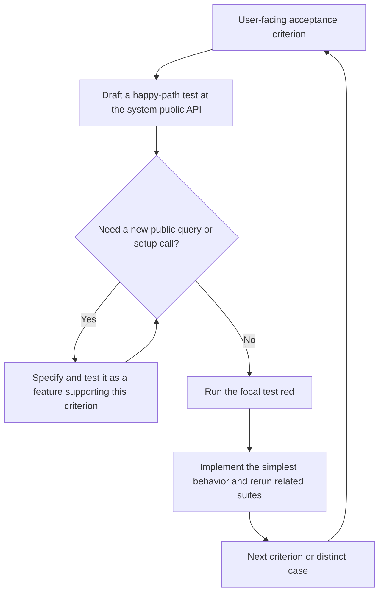

# Lean TDD for OpenSpec

Turn one user-facing acceptance criterion into a test at the system public API. Grow any public behavior that test needs, make the happy path pass, then repeat for the next criterion.

## Start a change

With the [OpenSpec CLI](https://github.com/Fission-AI/OpenSpec) installed and this repository checked out, run one command from your OpenSpec project:

```sh
node /path/to/openspec-lean-tdd-schema/scripts/start.mjs add-item-count
```

The command copies `openspec/schemas/lean-tdd/` into your project if needed and creates `add-item-count` with `--schema lean-tdd`. It leaves your project's default schema alone. You can pass the project directory as a second argument instead of running from it.

After trying a change, set `schema: lean-tdd` in your project's `openspec/config.yaml` if you want it as the default. [`examples/config.yaml`](examples/config.yaml) shows the minimal setting.

## How the loop works



For **AC-1: Adding an item increases the count**, start with `add_item()`:

```text
items = TodoList()
items.count()             -> 0
items.empty()             -> true
items.add_item("buy milk")
items.count()             -> 1
items.empty()             -> false
```

The `add_item()` test needs `count()` and `empty()` to observe its result. Give each query an observable requirement marked `**Supports:** AC-1`, test and implement those features inside the AC-1 task group, then return to `add_item()`. See the [spec](examples/sample-change/specs/todo-items/spec.md), [design](examples/sample-change/design.md), and [tasks](examples/sample-change/tasks.md) for the complete example.

The [testing trophy](https://kentcdodds.com/blog/the-testing-trophy-and-testing-classifications) helps choose test boundaries: the system public API often exercises interacting parts; broader end-to-end and focused unit checks add value when they cover a distinct risk. The schema does not require a UI harness or a test ratio.

## Origin and license

Forked from OpenSpec's `spec-driven` schema at [`79b6aa9`](https://github.com/Fission-AI/OpenSpec/commit/79b6aa9c98f1e36795b2bc4ef2a8f770c6d3a777). The artifact graph and apply tracking are unchanged. MIT; see [LICENSE](LICENSE).
