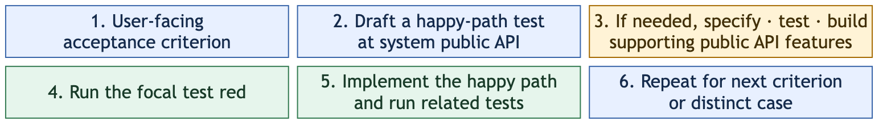

# Lean TDD for OpenSpec

[Brian Okken's Lean TDD](https://leantdd.com/) applies Lean principles to test-driven development: focus on valuable behavior and useful feedback while removing duplicated tests and other wasted effort.

This OpenSpec schema turns that approach into a workflow: turn one user-facing acceptance criterion into a test at the system public API. Grow any public behavior that test needs, make the happy path pass, then repeat for the next criterion.

## Start a change

With the [OpenSpec CLI](https://github.com/Fission-AI/OpenSpec) and Node.js installed, run one command from your OpenSpec project. npm fetches this repository from its [Git remote](https://github.com/jieli-matrix/openspec-schemas.git):

```sh
npm exec --yes --package=git+https://github.com/jieli-matrix/openspec-schemas.git -- openspec-lean-tdd your-openspec-change
```

Replace `your-openspec-change` with the name of the change you want to create. The command copies `openspec/schemas/lean-tdd/` into your project if needed and runs `openspec new change <name> --schema lean-tdd`. It leaves your project's default schema alone. You can pass a project directory after the change name instead of running from it.

After trying a change, set `schema: lean-tdd` in your project's `openspec/config.yaml` if you want it as the default. [`examples/config.yaml`](examples/config.yaml) shows the minimal setting.

## How the loop works



This to-do list example is adapted from [Brian Okken's *Lean TDD: TDD Without the Waste*](https://leantdd.com/). For **AC-1: Adding an item increases the count**, draft the first `add_item()` test in pytest:

```python
from todo_list import TodoList


def test_adding_an_item_increases_count():
    items = TodoList()
    assert items.count() == 0
    assert items.empty()

    items.add_item("buy milk")

    assert items.count() == 1
    assert not items.empty()
```

Writing the `add_item()` test reveals that it needs two other public methods: `count()` to observe the number of items and `empty()` to observe whether the list has any. Specify each as a feature marked `**Supports:** AC-1`, test and implement their new-list behavior, then return to the focal test and make `add_item()` pass. See the [spec](examples/sample-change/specs/todo-items/spec.md), [design](examples/sample-change/design.md), and [tasks](examples/sample-change/tasks.md) for the complete example.

The [testing trophy](https://kentcdodds.com/blog/the-testing-trophy-and-testing-classifications) helps choose test boundaries: the system public API often exercises interacting parts; broader end-to-end and focused unit checks add value when they cover a distinct risk. The schema does not require a UI harness or a test ratio.

## Attribution and license

The Lean TDD approach and original to-do list example come from [*Lean TDD: TDD Without the Waste*](https://leantdd.com/) by Brian Okken. The book and its original examples are © 2026 Brian Okken. This repository is an independent adaptation of those ideas for OpenSpec; its maintainer is not the book's author.

The schema is forked from OpenSpec's `spec-driven` schema at [`79b6aa9`](https://github.com/Fission-AI/OpenSpec/commit/79b6aa9c98f1e36795b2bc4ef2a8f770c6d3a777). The artifact graph and apply tracking are unchanged. This repository is MIT licensed; see [LICENSE](LICENSE). That license does not license the book.
